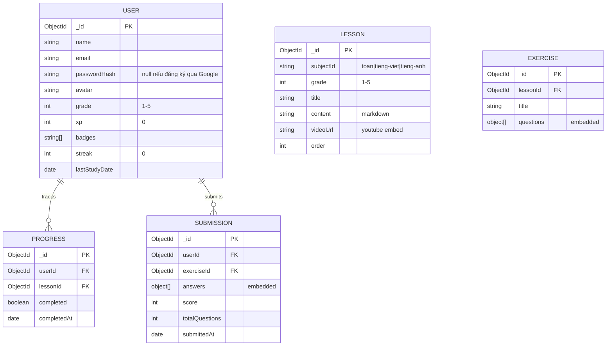

# 🌱 VườnTríTuệ – Tính năng (Solo Dev Edition)

> **Nguyên tắc**: 1 dev → ship nhanh, bỏ mọi thứ không cần thiết, quản lý nội dung trực tiếp qua DB.

## Đối tượng duy nhất: Học sinh tiểu học (Lớp 1–5)

Không phân quyền. Không admin panel. Không dashboard phụ huynh/giáo viên.
Dev quản lý nội dung & user trực tiếp qua MongoDB Compass / mongosh.

---

## Giai đoạn 1 – MVP 🚀

### 1. Tài khoản đơn giản

- [ ] Đăng ký / Đăng nhập bằng form (email + mật khẩu)
- [ ] Đăng ký / Đăng nhập qua Google OAuth
- [ ] Profile cơ bản (tên, avatar, chọn lớp)

### 2. Danh mục bài học

- [ ] Chọn lớp (1–5) → Chọn môn → Danh sách bài học
- [ ] Môn: Toán, Tiếng Việt, Tiếng Anh
- [ ] Nội dung bài học:
  - Text + hình minh họa (Markdown)
  - Embed video YouTube
- [ ] Đánh dấu "Đã học" → tính % hoàn thành

### 3. Bài tập

- [ ] Trắc nghiệm (A/B/C/D)
- [ ] Điền vào chỗ trống
- [ ] Đúng / Sai
- [ ] Chấm điểm tự động ngay khi nộp
- [ ] Hiển thị đáp án đúng + giải thích
- [ ] Lịch sử làm bài (điểm, thời gian)

### 4. Giao diện

- [ ] UI vui nhộn, màu sắc, font to rõ ràng
- [ ] Responsive (tablet + mobile)
- [ ] Trang chủ: chọn lớp → vào học luôn

---

## Giai đoạn 2 – Gamification ⭐

### 5. Game hóa (giữ chân học sinh)

- [ ] Điểm XP khi hoàn thành bài
- [ ] Streak (🔥 chuỗi ngày học liên tục)
- [ ] Huy hiệu đơn giản ("Học 7 ngày liền", "Toán giỏi", ...)
- [ ] Thanh tiến độ tổng quan trên trang chủ

### 6. Bổ sung nội dung

- [ ] Thêm môn: Khoa học, Lịch sử & Địa lý
- [ ] Flashcard (lật thẻ học từ vựng)
- [ ] Audio (nghe đọc Tiếng Anh / Tiếng Việt)

---

## Những thứ KHÔNG LÀM (tiết kiệm thời gian)

| Bỏ                       | Lý do                        |
| ------------------------ | ---------------------------- |
| ~~Admin panel~~          | Dev sửa DB trực tiếp         |
| ~~Phân quyền~~           | Chỉ có 1 role: học sinh      |
| ~~Dashboard phụ huynh~~  | Chưa cần giai đoạn đầu       |
| ~~Dashboard giáo viên~~  | Dev tự tạo nội dung          |
| ~~Bình luận / Diễn đàn~~ | Phải moderate, tốn thời gian |
| ~~Notification system~~  | Over-engineering             |
| ~~AI features~~          | Phức tạp, làm sau            |

---

## Tech Stack (Tối giản)

| Layer          | Công nghệ                                | Lý do                              |
| -------------- | ----------------------------------------- | ---------------------------------- |
| **Framework**  | Next.js (App Router)                     | Fullstack, SSR                     |
| **Language**   | TypeScript                               | Type-safe                          |
| **Database**   | MongoDB Atlas (free)                     | Schema linh hoạt, free 512MB       |
| **ODM**        | Mongoose                                 | Quen thuộc với JS dev              |
| **Auth**       | NextAuth.js (Credentials + Google OAuth) | Hỗ trợ cả đăng ký form và Google   |
| **UI**         | Tailwind CSS + shadcn/ui                 | Đẹp, nhanh                         |
| **Content**    | Markdown (MDX) hoặc lưu DB                | Linh hoạt                          |
| **Video**      | YouTube embed                            | Không cần hosting video            |
| **Deploy**     | Vercel (free)                             | Zero config                        |
| **Quản lý DB** | MongoDB Compass                          | GUI trực quan, CRUD dễ             |

---

## Database Schema (MongoDB – Đơn giản hóa)



### Cấu trúc `questions` (embed trong Exercise):

```json
{
  "questions": [
    {
      "type": "multiple_choice",
      "content": "3 + 5 = ?",
      "options": ["6", "7", "8", "9"],
      "correctAnswer": "8",
      "explanation": "Đếm thêm 5 từ số 3: 4, 5, 6, 7, 8"
    },
    {
      "type": "fill_blank",
      "content": "Con ___ kêu meo meo",
      "correctAnswer": "mèo",
      "explanation": "Con mèo là động vật nuôi trong nhà"
    },
    {
      "type": "true_false",
      "content": "Trái đất quay quanh Mặt trời",
      "correctAnswer": true,
      "explanation": "Trái đất quay quanh Mặt trời mất 365 ngày"
    }
  ]
}
```

> **Lưu ý**: `questions` được **embed** trực tiếp trong `Exercise`, không cần collection riêng → giảm query, đơn giản hóa code. Đây là lợi thế của MongoDB!

---

## Thứ tự phát triển đề xuất

```
 1-2:  Setup project + Auth (Google OAuth) + UI cơ bản
 3-4:  Trang bài học (hiển thị nội dung + video)
 5-6:  Bài tập + chấm điểm tự động
 7:    Tiến độ học tập + lịch sử làm bài
 8:    Polish UI + responsive + deploy
───────────────────────────────────────────
MVP XONG → Thu thập feedback
───────────────────────────────────────────
 9-10: Gamification (XP, streak, badges)
 11+:  Thêm nội dung, flashcard, audio
```

---

## Cách quản lý nội dung (không cần admin panel)

| Việc          | Cách làm                                               |
| ------------- | ------------------------------------------------------ |
| Thêm bài học  | Insert trực tiếp MongoDB Compass hoặc viết script seed |
| Sửa bài học   | Edit document trong Compass                            |
| Thêm bài tập  | Insert Exercise document với questions embedded        |
| Xem thống kê  | Query trực tiếp: `db.submissions.aggregate(...)`       |
| Xóa user spam | `db.users.deleteOne(...)`                              |

> 💡 **Tip**: Viết sẵn 1 file `seed.ts` để import hàng loạt bài học từ JSON, tiết kiệm thời gian nhập liệu.
